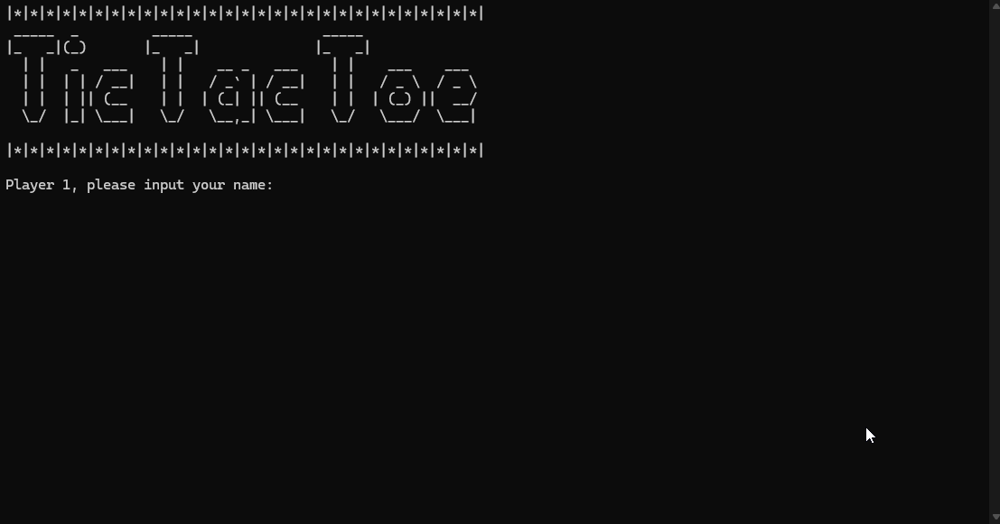

# Super Tic Tac Toe C / C++

Customizable Tic Tac Toe game with board sizes up to 7x7.

## Demo


## Features
- **Customizable Board Size:** Play on boards from 3x3 up to 7x7.
- **Editable Win Conditions:** Modify win conditions to suit your preferences.
- **Error Handling** Play worry-free with added error handling and victory checking.
- **User-Friendly Interface:** Easy to use with any IDE (Visual Studio Code recommended).

## How to Play
1. **Download the Program:**
   - Clone the repository or download the ZIP file.
   ```sh
   git clone https://github.com/your-username/super-tic-tac-toe.git

2. **Open in your IDE**
    - Visual Studio is what I use.

3. **Run the Program** 
    - Compile, run and have fun!